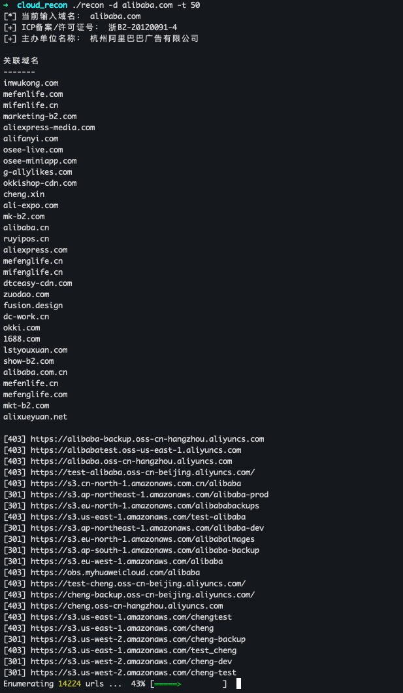

CloudRecon
==========

`CloudRecod`是以外部视角结合`OSINT`手段对目标单位云上资产进行枚举的辅助工具，旨在发现云上资产的潜在暴露面。

**已支持的功能**
- [x] 基于ICP备案查询关联域名
- [x] 枚举AWS、阿里云、华为云对象存储Bucket名称
- [x] 编写yaml格式枚举规则

Usage
-----
```
./recon -h
Usage of ./recon:
  -d string
    	domain
  -t int
    	threads (default 25)
```  

**截图示例**



项目灵感
-------
- [recon.cloud](https://recon.cloud/)
- [1in9e/icp-domains](https://github.com/1in9e/icp-domains)